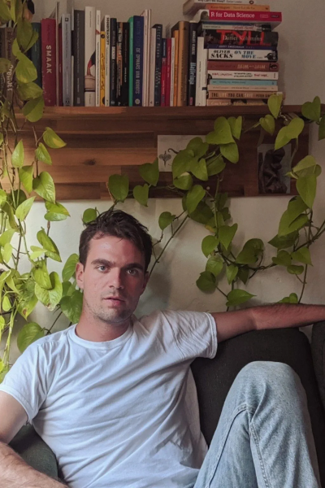

<link rel="stylesheet" type="text/css" href="typesettings.css"/>
I’m Anthony

I'm currently based in Toronto, Canada. I'm a master's student at
Ryerson and York University's Joint Program in Communication & Culture,
where I study digital methods and political subcultures online. In the
fall, I'll be joining the Digital Democracies Lab at the University of
Simon Fraser on a SSHRC Joseph Bombardier Scholarship. I'm the
co-founder of the [Digital Citizenship Cultures
Initiative](https://www.dcc.infoscapelab.ca). I'm also a part of the OI
Lab (which, if you know of it, will understand why I'm not linking) at
the University of Amsterdam. I used to work for the [Literary Review of
Canada](https://reviewcanada.ca), where I helped make our annual Spur
Festival of ideas.
